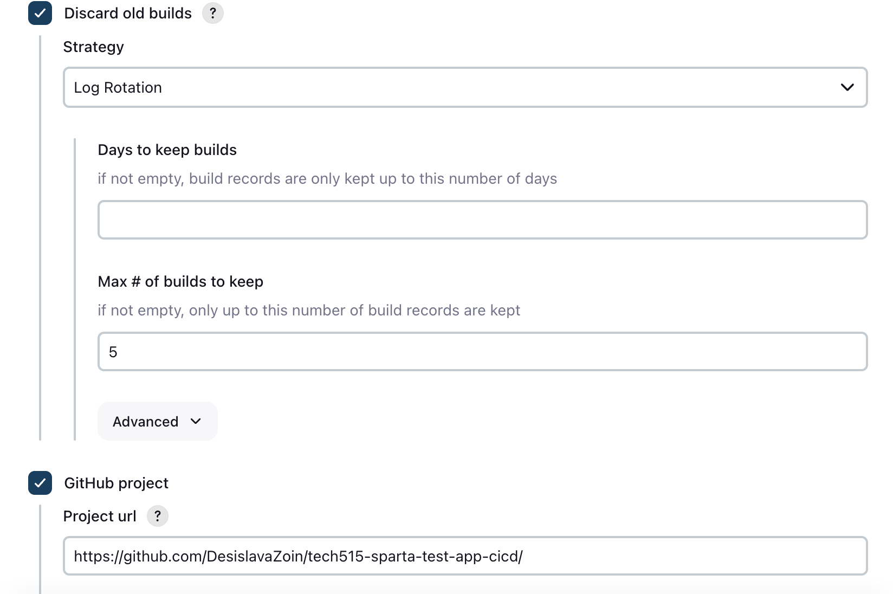
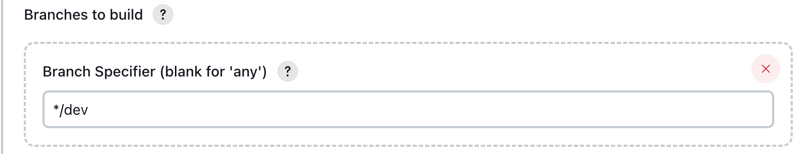
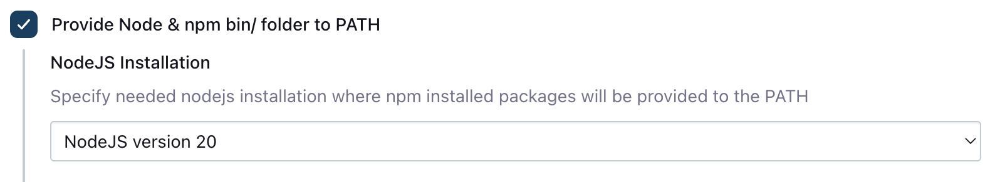
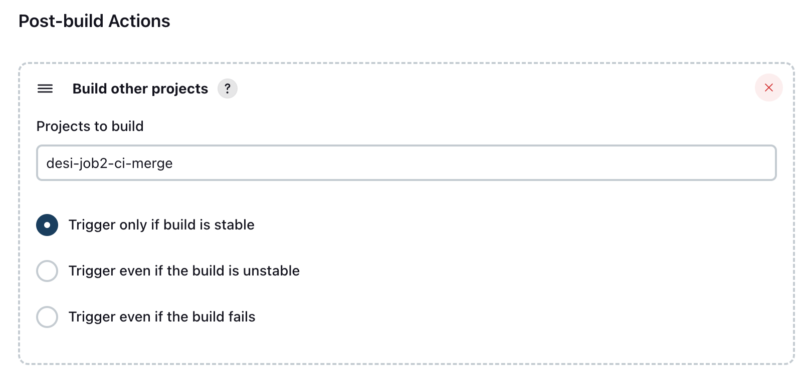

# Job 1 - CI Test (Dev Branch)

- [Job 1 - CI Test (Dev Branch)](#job-1---ci-test-dev-branch)
  - [Purpose](#purpose)
  - [Overview](#overview)
  - [Jenkins Configuration](#jenkins-configuration)
    - [General](#general)
    - [GitHub Project](#github-project)
    - [Source Code Management](#source-code-management)
  - [](#)
    - [Build Triggers](#build-triggers)
    - [Build Environment](#build-environment)
    - [Build Steps](#build-steps)
    - [Post-Build Actions](#post-build-actions)
      - [Trigger Job 2](#trigger-job-2)
    - [Result](#result)
    - [Benefits](#benefits)
  - [Testing Job 1 \& Job 2 (CI)](#testing-job-1--job-2-ci)

## Purpose
Job 1 runs automated tests on the `dev` branch to ensure code changes are validated before merging.

This ensures:
- Only tested code reaches Job 2
- Bugs are caught early
- Dev branch stays reliable

---

## Overview
- **Job name:** `desi-sparta-app-job1-ci`
- **Triggered by:** GitHub webhook on dev branch
- **Flow:** `dev → tests → Job 2`
- **Outcome:** Code tested on `dev`, triggers Job 2 if successful

---

## Jenkins Configuration

### General

- Tick **Discard old builds**
- **Max builds to keep:** `5`
- ⚠️ Leave "Restrict where this project can be run" **unticked**

Job 1 is triggered via a GitHub webhook.
Keeps Jenkins clean and avoids disk space issues.

### GitHub Project

- Tick **GitHub project**
- Project URL:
https://github.com/DesislavaZoin/tech515-sparta-test-app-cicd/

> The trailing `/` is required. Jenkins may not link correctly without it.

---

### Source Code Management

 
- **SCM:** Git  
- **Repository URL (SSH):**`git@github.com:DesislavaZoin/tech515-sparta-test-app-cicd.git`

- **Add Credentials** → choose Kind **SSH Username with private key**
  - **ID**: `desi-jenkins-2-github-key`
  - **Username**: `desi-jenkins-2-github-key`
  - Description: read/write to repo  
  - Private key added (key creation documented separately; can `cat` the file to copy its contents)

- **Select the added credential** from the Credentials dropdown

- **Branch specifier:** `*/dev` 
  
---

### Build Triggers
- Tick **GitHub hook trigger for GITScm polling**
  

This allows automatic builds when code is pushed to GitHub.

---

### Build Environment
- Tick **Provide Node & npm bin/ folder to PATH**
- **Node version:** 20
 

Ensures the app runs with the correct Node version (required by Sparta app)

---

### Build Steps
**Execute shell**
```bash
cd app
npm install
npm test
```
**What this does:**
- `cd app` – navigates to the app folder
- `npm install` – installs dependencies
- `npm test` – runs automated tests
  
### Post-Build Actions

#### Trigger Job 2
- Build other projects  
- Project: `desi-job2-ci-merge`
- Trigger only if build is stable

Ensures that Job 2 only runs after tests pass.

---

### Result
- GitHub webhook triggers Job 1
- Code changes on dev are tested
- If tests pass, Job 2 is triggered automatically
  
### Benefits 

- Detects bugs early in CI pipeline
- Prevents untested code from merging to main
- Automates testing for faster feedback

## Testing Job 1 & Job 2 (CI)

To test Job 1, a small change is made and pushed to the `dev` branch.

```bash
git switch dev
nano README.md
```
Add or modify a line in the file, then save and exit.
```
git add .
git commit -m "Test CI trigger"
```
- `git add .` stages the file changes
- `git commit` records the change locally
First push only:
```
git push --set-upstream origin dev
```
Subsequent pushes:
```
git push
```