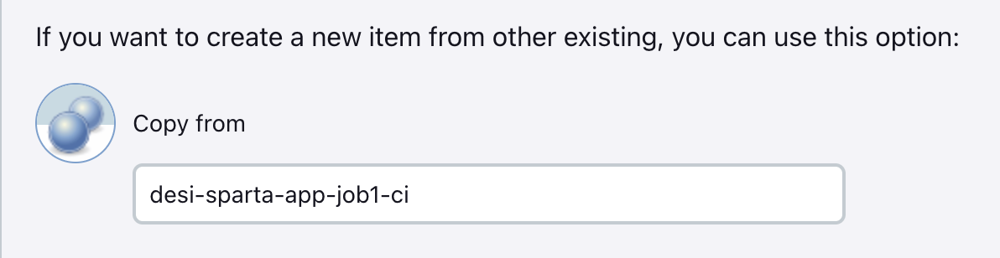
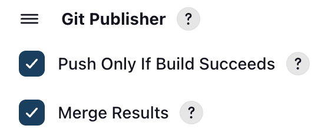
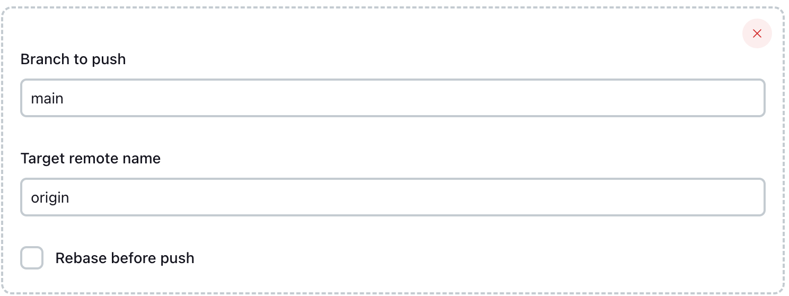
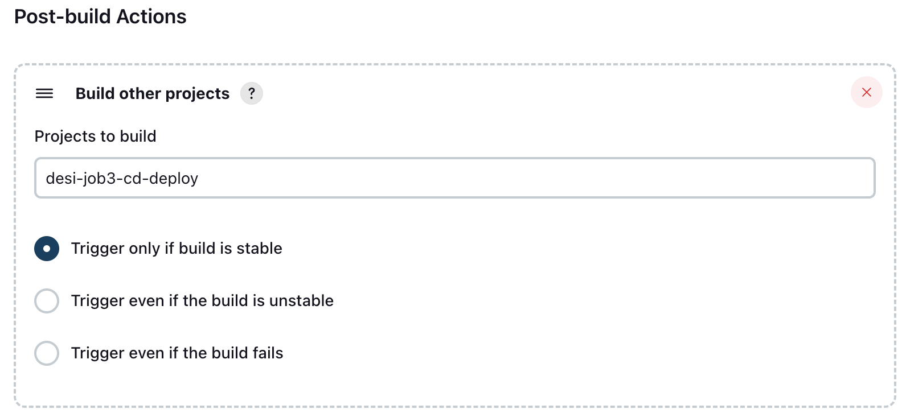

# Job 2 - CI Merge (Dev → Main)

- [Job 2 - CI Merge (Dev → Main)](#job-2---ci-merge-dev--main)
  - [Purpose](#purpose)
  - [Overview](#overview)
  - [Jenkins Configuration](#jenkins-configuration)
    - [General](#general)
    - [GitHub Project](#github-project)
    - [Source Code Management](#source-code-management)
    - [Option 1: Execute shell](#option-1-execute-shell)
      - [Build Environment](#build-environment)
      - [Build Step](#build-step)
    - [Option 2: Git Publisher (Best Practice)](#option-2-git-publisher-best-practice)
    - [Post-Build Actions](#post-build-actions)
      - [Trigger Job 3](#trigger-job-3)
    - [Result](#result)
    - [Benefits](#benefits)


## Purpose

Job 2 automatically merges tested code from the `dev` branch into `main` after Job 1 succeeds.

This ensures:
- `main` always contains stable code
- No manual merges
- Deployment only happens with tested changes

---

## Overview

- **Job name:** `desi-job2-ci-merge`
- **Triggered by:** Successful Job 1 build
- **Branch flow:** `dev → main`
- **Outcome:** Code merged into `main`, Job 3 triggered

---

## Jenkins Configuration
> 💡 Job 2 can be created by copying Job 1 and updating the relevant settings:
> - Untick **GitHub hook trigger** (not needed)
> - **Provide Node & npm bin/ folder to PATH can be unticked** (not needed)
> - In Post-Build Actions:
>   - Use **Git Publisher** to merge dev → main (best practice)  
>   - **Trigger Job 3** after a successful build
> - SCM remains the same


### General

- Tick **Discard old builds**
- **Max builds to keep:** `5`
- ⚠️ Leave "Restrict where this project can be run" **unticked**

Keeps Jenkins clean and avoids disk space issues.

---

### GitHub Project

- Tick **GitHub project**
- Project URL:
https://github.com/DesislavaZoin/tech515-sparta-test-app-cicd/

> The trailing `/` is required. Jenkins may not link correctly without it.

### Source Code Management

- **SCM:** Git  
- **Repository URL (SSH):**
`git@github.com:DesislavaZoin/tech515-sparta-test-app-cicd.git`
- **Credentials:** `desi-jenkins-2-github-key`  
- **Branch specifier:**
`*/dev`

---

### Option 1: Execute shell

#### Build Environment

- ✅ **SSH Agent must be enabled**

SSH is required so Jenkins can push the merge back to GitHub.


#### Build Step
**Execute shell**

```bash
git fetch origin
git checkout main
git pull origin main
git merge origin/dev
git push origin main
```
**What this does:**
- Syncs with remote
- Updates `main`
- Merges tested `dev` changes
- Pushes the result to GitHub

---

### Option 2: Git Publisher (Best Practice)
- ❌ **SSH Agent not required**
- ❌ **No Execute Shell**
- Go to Post-Build Actions
- Select **Git Publisher**  
- Tick:  
    - Push only if build succeeds  
    - Merge results  
    
- Branch to push: `main`  
- Target remote name: `origin` 
  

Cleaner and more reliable than shell-only merging.

---
  
### Post-Build Actions

#### Trigger Job 3
- Build other projects  
- Project: `desi-job3-cd-deploy`  
- Trigger only if build is stable  

Ensures deployment only runs with successful merges.

---

### Result

- Job 1 tests code on `dev`
- Job 2 merges `dev → main`
- `main` stays stable
- Job 3 deploys verified code only
  
### Benefits 

- Prevents untested code reaching production
- Removes manual merge errors
- Matches real-world CI pipelines
- Reliable and repeatable deployments

