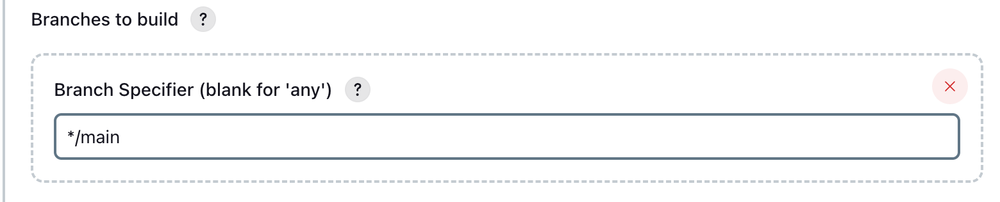

# Job 3 - CD Deploy to EC2

- [Job 3 - CD Deploy to EC2](#job-3---cd-deploy-to-ec2)
  - [Purpose](#purpose)
  - [Overview](#overview)
  - [Jenkins Configuration](#jenkins-configuration)
    - [General](#general)
    - [GitHub Project](#github-project)
    - [Source Code Management](#source-code-management)
  - [](#)
    - [Build Environment](#build-environment)
    - [Build Step](#build-step)
    - [Result](#result)
    - [Benefits](#benefits)
  - [Testing Job 3 (CD Deployment)](#testing-job-3-cd-deployment)
    - [Frontpage Update](#frontpage-update)
  - [Expected Result](#expected-result)


## Purpose
Job 3 deploys the tested and merged app from Jenkins to the EC2 production instance.

Ensures:
- Production runs only validated code
- Deployment is automated
- No manual pushes or cloning from main

---

## Overview
- **Job name:** `desi-job3-cd-deploy`
- **Triggered by:** Successful Job 2 build
- **Flow:** main → EC2 deployment
- **Outcome:** App updated on EC2 with latest tested code

---

## Jenkins Configuration

### General
- Tick **Discard old builds**
- **Max builds to keep:** 5
- ⚠️ Leave "Restrict where this project can be run" **unticked**

---

### GitHub Project

- Tick **GitHub project**
- Project URL:
https://github.com/DesislavaZoin/tech515-sparta-test-app-cicd/

> The trailing `/` is required. Jenkins may not link correctly without it.

### Source Code Management

 
- **SCM:** Git  
- **Repository URL (SSH):**`git@github.com:DesislavaZoin/tech515-sparta-test-app-cicd.git`
- **Credentials:** `desi-jenkins-2-github-key` 
- **Branch specifier:** `*/main` 
  
---

### Build Environment
- Tick **SSH Agent**  
- Add credential:
  - Kind: **SSH Username with private key**  
  - ID/Username: `tech515-desislava-aws`  
  - Private key: paste **AWS EC2 PEM file** (can `cat` the file to copy its contents)
- **Select the added credential** from the Credentials dropdown
- Jenkins uses this credential for all `ssh` and `scp` commands

> No SCM is configured. Job 3 deploys files already copied from Job 2.  
> 
> GitHub Project checkbox is not needed.

---

### Build Step
**Execute shell**
```bash
# Copy the app folder to EC2
scp -r -o StrictHostKeyChecking=no app ubuntu@<vm-ip>:/home/ubuntu/app

# SSH into EC2 and restart the app
ssh -o StrictHostKeyChecking=no ubuntu@<vm-ip> << EOF
cd /home/ubuntu
npm install
pm2 stop all || true
pm2 start app.js
EOF
```

What this does:
- `scp` → copies built app from Jenkins to EC2
- `ssh << EOF` → runs commands on EC2:
- `cd /home/ubuntu/app` – navigate to app folder
- `npm install` – install dependencies
- `pm2 stop all || true` – stops running processes (ignores errors if none)
- `pm2 start app.js` – starts the app

This avoids git cloning in production and keeps deployment safe.

### Result
- Latest tested code is deployed on EC2
- App restarted automatically
- Production environment matches `main`

### Benefits
- Automated deployment
- No manual SSH or copy steps
- Reduces human error
- Keeps production consistent with tested code

## Testing Job 3 (CD Deployment)

To verify that Job 3 deploys changes to the frontpage via the CICD pipeline:

1. Navigate to the app views folder:
```bash
cd ~/app/views
```
2. Edit the frontpage (index.ejs) to add a timestamped change
```html
<h2>The app is running correctly.</h2>
Change via Jenkins CICD pipeline on 23/12/25 11:31
```
- Save and exit the editor
3. Stage and commit the change:
```
git add .
git commit -m "change frontpage 11:31"
git push
```
4. Wait for the pipeline to run:
- Job 1 tests the dev branch
- Job 2 merges dev → main
- Job 3 deploys the updated app to EC2

5. Repeat the process with a new timestamp to confirm the pipeline reliably redeploys changes.


### Frontpage Update
- **1st change:**  


- **2nd change:**  

   
## Expected Result
- Frontpage reflects the timestamped change
- Jenkins pipeline runs automatically
- Confirms Job 3 deploys changes from main to EC2