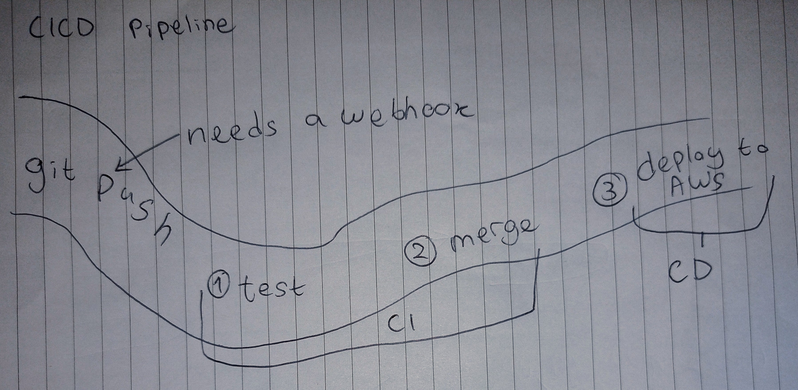
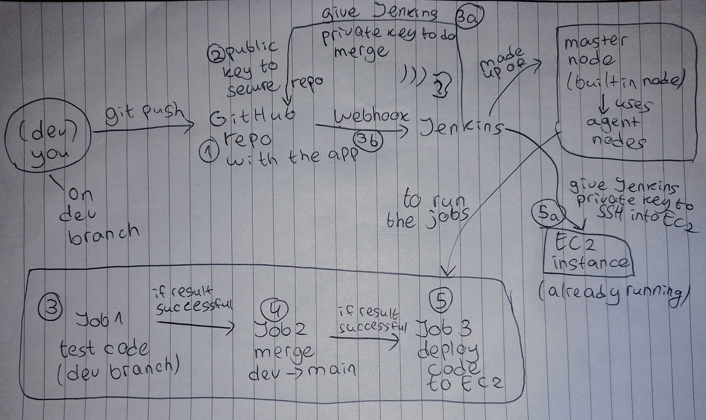
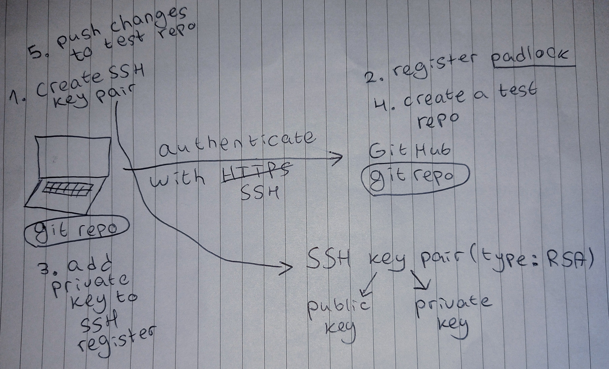

# CICD Pipeline Overview
- [CICD Pipeline Overview](#cicd-pipeline-overview)
  - [Purpose](#purpose)
  - [Pipeline Flow](#pipeline-flow)
    - [High-Level Pipeline Diagram](#high-level-pipeline-diagram)
    - [Detailed Pipeline Flow](#detailed-pipeline-flow)
  - [Supporting Setup](#supporting-setup)
    - [SSH GitHub Key Flow](#ssh-github-key-flow)
  - 
  - [Screenshots](#screenshots)
  - [Notes](#notes)

## Purpose
This document provides a high-level overview of the CICD pipeline for the Sparta test app.

- 3 Jenkins jobs automate testing, merging, and deployment
- Webhook triggers the pipeline
- SSH keys are used for GitHub and AWS EC2 access
- [Intro to Jenkins & CICD](cicd-with-jenkins/README.md) gives background on CI/CD concepts

---

## Pipeline Flow

### High-Level Pipeline Diagram

### Detailed Pipeline Flow

1. **Job 1 - CI Test**
   - Tests changes pushed to `dev` branch
   - Runs automated Node.js tests
   - [Detailed Job 1 doc](cicd-with-jenkins/job1.md)

2. **Job 2 - CI Merge**
   - Merges tested changes from `dev` → `main`
   - Triggers Job 3 if build succeeds
   - [Detailed Job 2 doc](cicd-with-jenkins/job2.md)

3. **Job 3 - CD Deploy**
   - Deploys verified code from `main` to AWS EC2
   - [Detailed Job 3 doc](cicd-with-jenkins/job3.md)

---

## Supporting Setup
- **GitHub Webhook:** [Setup doc](cicd-with-jenkins/github-webhook.md)
- **GitHub SSH Key:** [Setup doc](ssh/github-ssh-access.md)
- **Jenkins SSH Key for EC2:** [Setup doc](ssh/jenkins-github-ssh-key.md)

### SSH GitHub Key Flow

---

## Screenshots
- All relevant screenshots for jobs and SSH keys are in `images/` folder.

---

## Notes
- The pipeline ensures tested changes are safely deployed
- Fully automated, repeatable, and mirrors real-world CI/CD best practices
