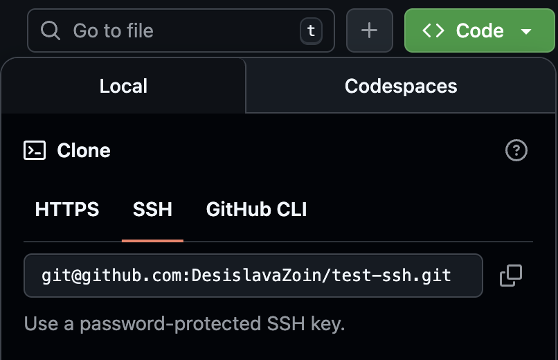

# GitHub SSH Access Setup

- [GitHub SSH Access Setup](#github-ssh-access-setup)
  - [SSH Key Generation](#ssh-key-generation)
  - [Add SSH Key to GitHub](#add-ssh-key-to-github)
  - [Verify SSH Access](#verify-ssh-access)
  - [Testing SSH Access](#testing-ssh-access)
  - [Expected result:](#expected-result)

This is required for:
- Pushing code from local machine
- Jenkins interacting with GitHub over SSH

---

## SSH Key Generation 

```bash
cd ~/.ssh
ssh-keygen -t rsa -b 4096 -C "desizzzzo@gmail.com"
```
This generates:
- A private key (kept locally)
- A public key (`.pub`) to be added to GitHub

## Add SSH Key to GitHub

1. Go to GitHub → Settings → SSH and GPG keys
2. Click New SSH key
3. Set:
   - Title: desi-github-key
   - Key: contents of desi-github-key.pub
4. Click Add SSH key
5. Complete authentication (GitHub 2FA)
   
## Verify SSH Access
```
eval `ssh-agent -s`
ssh-add desi-github-key
ssh -T git@github.com
```
Successful authentication confirms SSH access is working.

## Testing SSH Access

After adding the SSH key to GitHub, it was tested by cloning a test repository and pushing changes:



```bash
cd ~/Desktop/Sparta/GitHub
git clone git@github.com:DesislavaZoin/test-ssh.git
cd test-ssh
nano README.md      # make a small change
git add .
git commit -m "update readme"
git push
```

## Expected result:
- Repository is cloned via SSH
- Changes are successfully pushed back to GitHub
- Confirms SSH key is working for read/write access